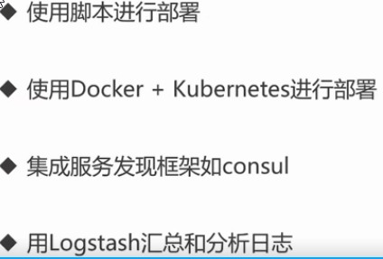

## 分布式爬虫
1. 分布式有哪些要素
        
        1. 多个节点
            容错性，可扩展性（性能），固有分布性
        2. 消息传递
            1. 节点具有私有存储，易于开发，可扩展性（功能），对比:并行计算
            2. 消息传递方法：
                REST（http网络接口）-> 对外，模块间
                RPC（函数调用序列号）-> 模块内部
                中间件（MQ）-> 模块之间
        3. 完成特定需求
2. 分布式架构 vs 微服务
        
        1. 分布式：指导节点之间如何通信
        2. 微服务：鼓励按业务划分模块
        3. 微服务架构通过分布式架构来实现
3. 多层架构 vs 微服务

        1. 微服务具有更多的 “服务”
        2. 微服务通常要配合自动化测试，部署，服务发现等
        3. 目前我们倾向于微服务架构

### 二，RPC demo演示
1. 启动RPC服务
2. 在控制台进行连接RPC服务：
        
        1. telnet localhost 1234 (xshell)
        2.1. 输入数据：{"method":"DemoService.Div","params":[{"A":2,"B":4}],"id":1}
        2.2. 响应数据：{"id":1,"result":0.5,"error":null}
        3. 编程code进行测试
### 三，分布式爬虫运行步骤

    1. 启动docker
    2. 启动RPC 服务
    3. 启动爬虫客户端

### 四，启动当前分布式爬虫步骤
    1. elastic: go run crawlers_distributed/persist/server/main.go --port=1234
    2. worker:  go run crawlers_distributed/worker/server/rpc_server_main.go  --port=9000
                go run crawlers_distributed/worker/server/rpc_server_main.go  --port=9001 （可以启动多个）
    3. client:  go run crawlers_distributed/client_main.go --itemSaver_host=":1234" --worker_hosts=":9000,:9001"
    
### 五，进一步工作
